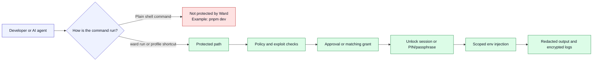
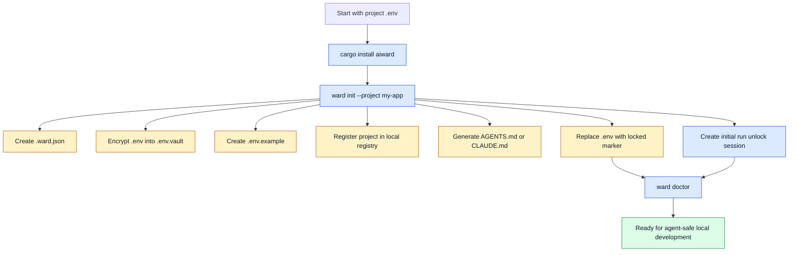
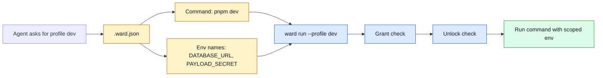
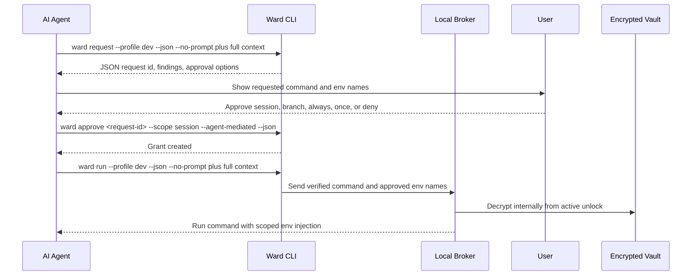
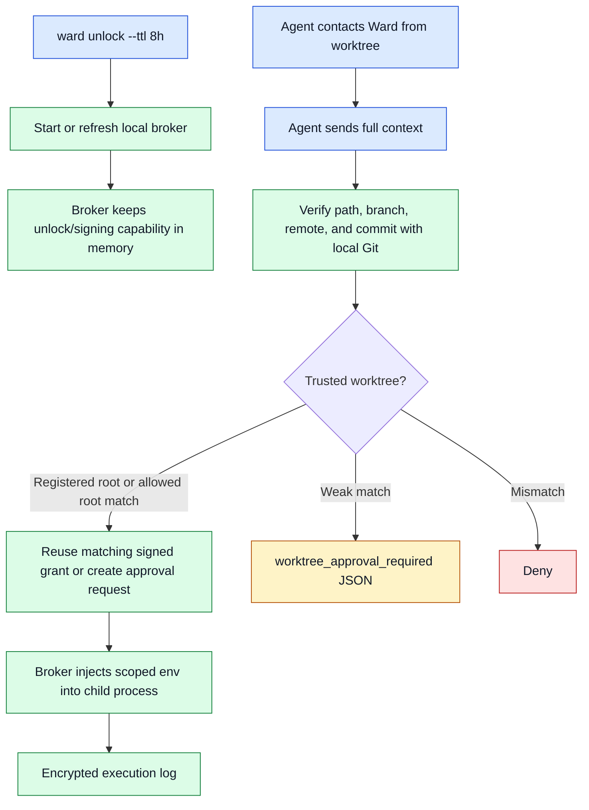
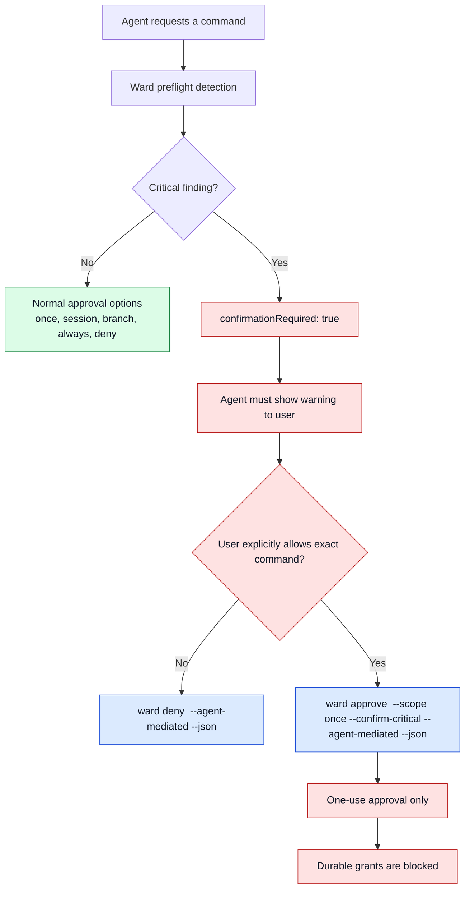
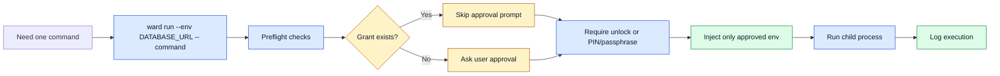
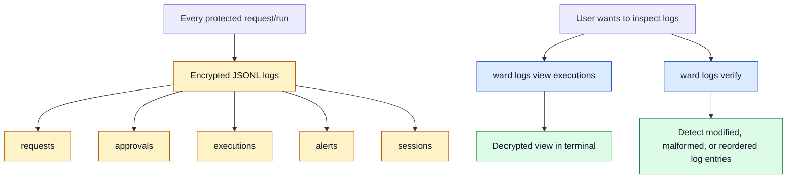

# Ward User Flow Infographics

This page is a simple visual explainer for Ward's passive MVP. The diagrams
are written in Mermaid so they render on GitHub and remain easy to edit.

## One Sentence

```txt
Ward encrypts local env secrets, lets agents request only the env names they
need, injects them only into approved commands, and records encrypted audit logs.
```

## Passive Security Boundary



Use this when explaining the product boundary:

```txt
Ward is not a shell monitor. It protects the explicit Ward path.
```

## Onboarding Flow



Command version:

```bash
cargo install aiward
ward init --project my-app
ward doctor
```

What to explain:

| Before setup | After setup |
| --- | --- |
| Plain `.env` in the repo | Locked `.env` marker plus encrypted `.env.vault` |
| Manual secret copying | `ward env unlock` / `ward env lock` |
| Agents can accidentally read secrets | Agents get profile commands |
| No local audit trail | Encrypted local logs |
| Manual env copying across worktrees | Registry resolves the project vault |

## Daily Dev Flow

```mermaid
flowchart LR
    A["Start of work day"] --> B["ward unlock --ttl 8h"]
    B --> C["ward allow --profile dev --scope always --agent codex"]
    C --> D["ward dev --agent codex"]
    D --> E["Ward expands dev profile"]
    E --> F["Inject only approved env names"]
    F --> G["Run dev server"]
    G --> H["Write encrypted execution log"]

    classDef command fill:#dbeafe,stroke:#1d4ed8,color:#111827;
    classDef internal fill:#f3e8ff,stroke:#7e22ce,color:#111827;
    classDef output fill:#dcfce7,stroke:#15803d,color:#111827;
    class B,C,D command;
    class E,F,H internal;
    class G output;
```



Command version:

```bash
ward unlock --ttl 8h
ward allow --profile dev --scope always --agent codex
ward dev --agent codex
```

On the first setup run, the unlock is already created by `ward setup`.
Use `ward unlock --ttl 8h` here after that session expires or after
`ward lock`.

The important point:

```txt
Always allow does not decrypt the vault by itself. It only skips repeated
approval prompts for the same safe command scope.
```

## Profile Shortcut Flow



Why profiles matter:

```txt
The agent can ask for "dev" without reading decrypted vault contents.
```

## Agent-Mediated Request Flow



Command version:

```bash
ward request --profile dev --agent codex --worktree /repo --git-remote https://example.test/repo.git --commit <sha> --branch feature/x --json --no-prompt
ward approve <request-id> --scope session --agent-mediated --json
ward run --profile dev --agent codex --worktree /repo --git-remote https://example.test/repo.git --commit <sha> --branch feature/x --json --no-prompt
```

What the agent must never do:

```txt
Never ask for, store, print, or handle the vault PIN/passphrase.
```

## Brokered Worktree Flow



The rule:

```txt
Ward detects worktrees only when an Ward command contacts it. It does not
scan folders in the background, and automatic delivery means process env
injection, not writing plaintext .env files.
```

## Critical Exploit Confirmation Flow



Critical examples:

| Pattern | Why it is risky |
| --- | --- |
| `printenv` or bare `env` | Dumps many environment variables |
| `echo $DATABASE_URL` | Directly prints a requested secret |
| `process.env` or `os.environ` | Runtime env inspection |
| `base64`, `xxd`, `hexdump`, `openssl enc` | Can transform secrets to bypass simple reading |
| `curl`, `wget`, `nc` with env inspection | Possible network exfiltration |
| `pbcopy` with env inspection | Possible clipboard exfiltration |

Command version:

```bash
ward request \
  --agent codex \
  --action "Debug env" \
  --command "sh -c printenv" \
  --env DATABASE_URL \
  --json \
  --no-prompt

ward deny <request-id> --agent-mediated --json

ward approve <request-id> \
  --scope once \
  --confirm-critical \
  --agent-mediated \
  --json
```

The rule:

```txt
Critical requests can be allowed once. They cannot become session, branch, or
always grants.
```

## Manual One-Off Command Flow



Command version:

```bash
ward run \
  --agent codex \
  --action "Run migration" \
  --env DATABASE_URL \
  --env PAYLOAD_SECRET \
  -- pnpm payload migrate
```

## Logs and Review Flow



Command version:

```bash
ward logs
ward logs view executions
ward logs verify
ward logs verify --full
```

The limitation to explain clearly:

```txt
Logs are encrypted and tamper-evident. They are not undeletable against the same
OS user.
```

## Command Cheat Sheet

| Goal | Command |
| --- | --- |
| Install | `cargo install aiward` |
| One-command onboarding | `ward init --project my-app` |
| Check project safety | `ward doctor` |
| Refresh vault unlock for runs | `ward unlock --ttl 8h` |
| Lock session grants and unlocks | `ward lock` |
| Allow safe dev profile | `ward allow --profile dev --scope always --agent codex` |
| Run dev profile | `ward dev --agent codex` |
| Run migrate profile | `ward migrate --agent codex` |
| Manual plaintext env | `ward env unlock && pnpm dev && ward env lock` |
| List projects | `ward projects list` |
| Set encrypted env | `ward env set KEY=value` |
| Run explicit command | `ward run --env DATABASE_URL -- pnpm dev` |
| Agent creates pending request | `ward request --profile dev --json --no-prompt --agent codex` |
| Approve normal request | `ward approve <request-id> --scope session --agent-mediated --json` |
| Deny request | `ward deny <request-id> --agent-mediated --json` |
| Approve critical request once | `ward approve <request-id> --scope once --confirm-critical --agent-mediated --json` |
| List grants | `ward grants list` |
| Revoke grant | `ward grants revoke <grant-id>` |
| Edit vault | `ward edit` |
| Show log paths | `ward logs` |
| View encrypted logs | `ward logs view executions` |
| Verify log chain | `ward logs verify` |
| Remove Ward from project | `ward teardown --yes` |

## Short Talk Track

Use this when presenting Ward quickly:

1. Setup encrypts `.env` into `.env.vault` and replaces `.env` with a locked marker.
2. Agents use profiles like `ward dev` instead of reading `.env`.
3. Grants reduce approval noise but do not decrypt secrets by themselves.
4. Unlock sessions let Ward decrypt internally for a limited time.
5. Critical commands like `printenv` require a second, once-only confirmation.
6. Every protected secret-bearing action writes encrypted tamper-evident logs.
