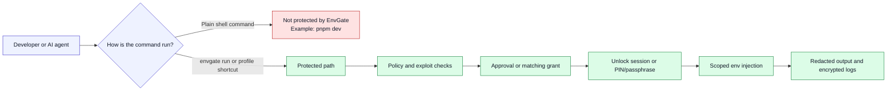
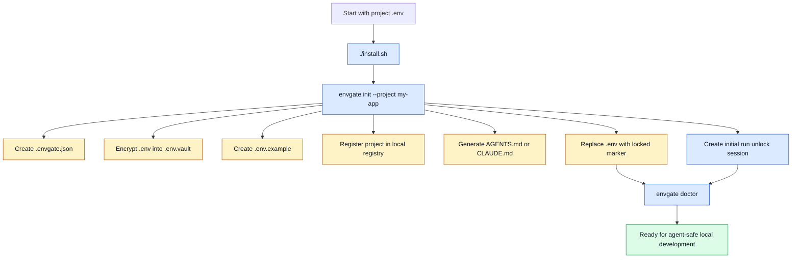
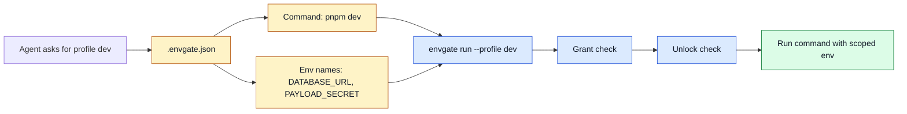
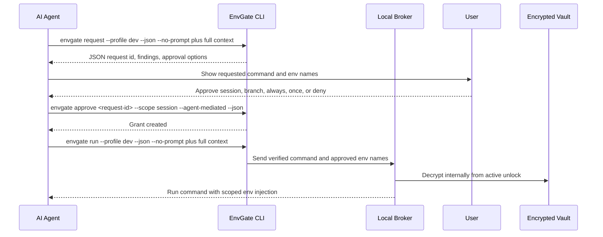
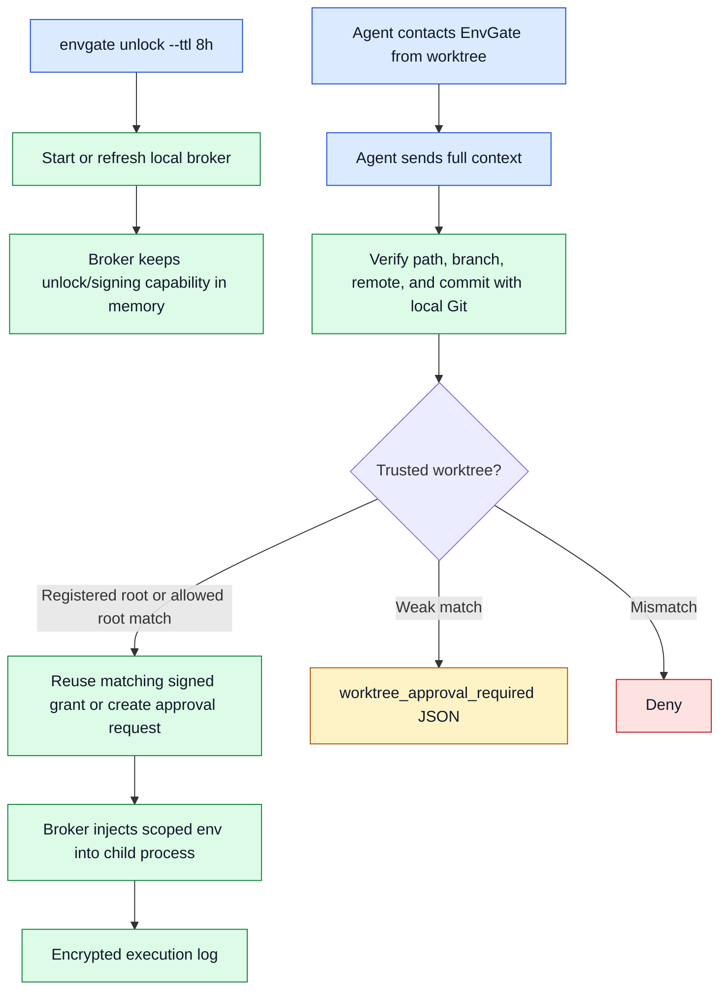
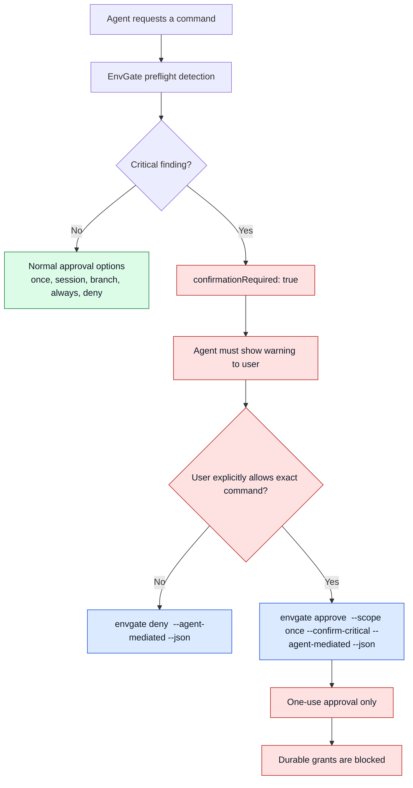
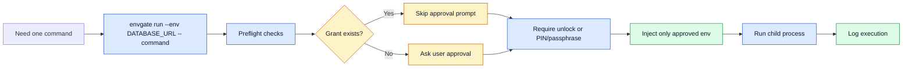
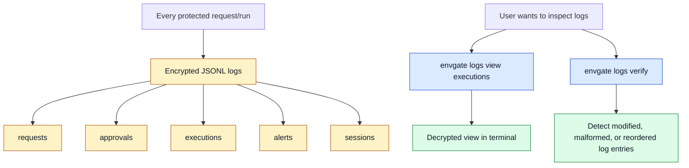

# EnvGate User Flow Infographics

This page is a simple visual explainer for EnvGate's passive MVP. The diagrams
are written in Mermaid so they render on GitHub and remain easy to edit.

## One Sentence

```txt
EnvGate encrypts local env secrets, lets agents request only the env names they
need, injects them only into approved commands, and records encrypted audit logs.
```

## Passive Security Boundary



Use this when explaining the product boundary:

```txt
EnvGate is not a shell monitor. It protects the explicit EnvGate path.
```

## Onboarding Flow



Command version:

```bash
./install.sh
envgate init --project my-app
envgate doctor
```

What to explain:

| Before setup | After setup |
| --- | --- |
| Plain `.env` in the repo | Locked `.env` marker plus encrypted `.env.vault` |
| Manual secret copying | `envgate env unlock` / `envgate env lock` |
| Agents can accidentally read secrets | Agents get profile commands |
| No local audit trail | Encrypted local logs |
| Manual env copying across worktrees | Registry resolves the project vault |

## Daily Dev Flow

```mermaid
flowchart LR
    A["Start of work day"] --> B["envgate unlock --ttl 8h"]
    B --> C["envgate allow --profile dev --scope always --agent codex"]
    C --> D["envgate dev --agent codex"]
    D --> E["EnvGate expands dev profile"]
    E --> F["Inject only approved env names"]
    F --> G["Run dev server"]
    G --> H["Write encrypted execution log"]

    classDef command fill:#dbeafe,stroke:#1d4ed8,color:#111827;
    classDef internal fill:#f3e8ff,stroke:#7e22ce,color:#111827;
    classDef output fill:#dcfce7,stroke:#15803d,color:#111827;
    class B,C,D command;
    class E,F,H internal;
    class G output;
```



Command version:

```bash
envgate unlock --ttl 8h
envgate allow --profile dev --scope always --agent codex
envgate dev --agent codex
```

On the first setup run, the unlock is already created by `envgate setup`.
Use `envgate unlock --ttl 8h` here after that session expires or after
`envgate lock`.

The important point:

```txt
Always allow does not decrypt the vault by itself. It only skips repeated
approval prompts for the same safe command scope.
```

## Profile Shortcut Flow



Why profiles matter:

```txt
The agent can ask for "dev" without reading decrypted vault contents.
```

## Agent-Mediated Request Flow



Command version:

```bash
envgate request --profile dev --agent codex --worktree /repo --git-remote https://example.test/repo.git --commit <sha> --branch feature/x --json --no-prompt
envgate approve <request-id> --scope session --agent-mediated --json
envgate run --profile dev --agent codex --worktree /repo --git-remote https://example.test/repo.git --commit <sha> --branch feature/x --json --no-prompt
```

What the agent must never do:

```txt
Never ask for, store, print, or handle the vault PIN/passphrase.
```

## Brokered Worktree Flow



The rule:

```txt
EnvGate detects worktrees only when an EnvGate command contacts it. It does not
scan folders in the background, and automatic delivery means process env
injection, not writing plaintext .env files.
```

## Critical Exploit Confirmation Flow



Critical examples:

| Pattern | Why it is risky |
| --- | --- |
| `printenv` or bare `env` | Dumps many environment variables |
| `echo $DATABASE_URL` | Directly prints a requested secret |
| `process.env` or `os.environ` | Runtime env inspection |
| `base64`, `xxd`, `hexdump`, `openssl enc` | Can transform secrets to bypass simple reading |
| `curl`, `wget`, `nc` with env inspection | Possible network exfiltration |
| `pbcopy` with env inspection | Possible clipboard exfiltration |

Command version:

```bash
envgate request \
  --agent codex \
  --action "Debug env" \
  --command "sh -c printenv" \
  --env DATABASE_URL \
  --json \
  --no-prompt

envgate deny <request-id> --agent-mediated --json

envgate approve <request-id> \
  --scope once \
  --confirm-critical \
  --agent-mediated \
  --json
```

The rule:

```txt
Critical requests can be allowed once. They cannot become session, branch, or
always grants.
```

## Manual One-Off Command Flow



Command version:

```bash
envgate run \
  --agent codex \
  --action "Run migration" \
  --env DATABASE_URL \
  --env PAYLOAD_SECRET \
  -- pnpm payload migrate
```

## Logs and Review Flow



Command version:

```bash
envgate logs
envgate logs view executions
envgate logs verify
envgate logs verify --full
```

The limitation to explain clearly:

```txt
Logs are encrypted and tamper-evident. They are not undeletable against the same
OS user.
```

## Command Cheat Sheet

| Goal | Command |
| --- | --- |
| Install locally | `./install.sh` |
| One-command onboarding | `envgate init --project my-app` |
| Check project safety | `envgate doctor` |
| Refresh vault unlock for runs | `envgate unlock --ttl 8h` |
| Lock session grants and unlocks | `envgate lock` |
| Allow safe dev profile | `envgate allow --profile dev --scope always --agent codex` |
| Run dev profile | `envgate dev --agent codex` |
| Run migrate profile | `envgate migrate --agent codex` |
| Manual plaintext env | `envgate env unlock && pnpm dev && envgate env lock` |
| List projects | `envgate projects list` |
| Set encrypted env | `envgate env set KEY=value` |
| Run explicit command | `envgate run --env DATABASE_URL -- pnpm dev` |
| Agent creates pending request | `envgate request --profile dev --json --no-prompt --agent codex` |
| Approve normal request | `envgate approve <request-id> --scope session --agent-mediated --json` |
| Deny request | `envgate deny <request-id> --agent-mediated --json` |
| Approve critical request once | `envgate approve <request-id> --scope once --confirm-critical --agent-mediated --json` |
| List grants | `envgate grants list` |
| Revoke grant | `envgate grants revoke <grant-id>` |
| Edit vault | `envgate edit` |
| Show log paths | `envgate logs` |
| View encrypted logs | `envgate logs view executions` |
| Verify log chain | `envgate logs verify` |
| Remove EnvGate from project | `envgate teardown --yes` |

## Short Talk Track

Use this when presenting EnvGate quickly:

1. Setup encrypts `.env` into `.env.vault` and replaces `.env` with a locked marker.
2. Agents use profiles like `envgate dev` instead of reading `.env`.
3. Grants reduce approval noise but do not decrypt secrets by themselves.
4. Unlock sessions let EnvGate decrypt internally for a limited time.
5. Critical commands like `printenv` require a second, once-only confirmation.
6. Every protected secret-bearing action writes encrypted tamper-evident logs.
